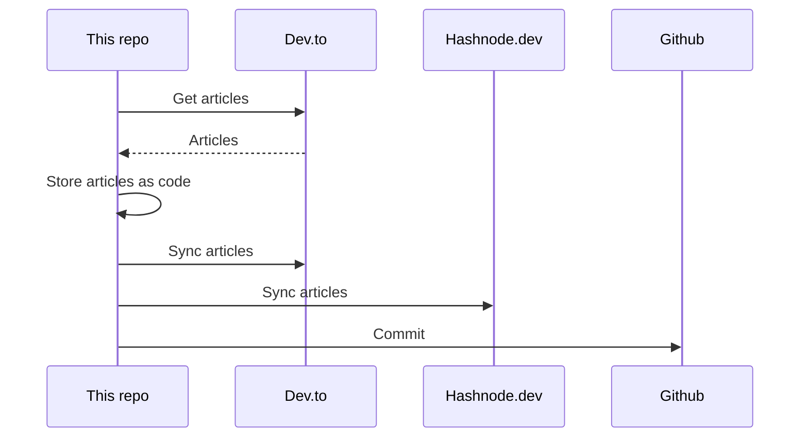

## About
This is the "single source of truth" that stores all my articles.

It utilizes [huantt/article-as-code](https://github.com/huantt/article-as-code) to collect, store, and sync all my articles to various platforms, including [dev.to](https://dev.to) and [hashnode.dev](https://hashnode.dev).

## GitHub Action
I have created a GitHub action in the `.github/workflows` directory that runs every 6 hours or whenever you commit to the `main` branch.

## My Recent Articles

<table>
        <tr>
            <td width="300px">
                <a href="https://dev.to/jacktt/postgres-isolation-levels-72h">
                    
                </a>
            </td>
            <td>
                <a href="https://dev.to/jacktt/postgres-isolation-levels-72h">[Postgres] Isolation levels</a>
                <div>In PostgreSQL, isolation levels determine how transaction integrity is maintained when multiple...</div>
                <div><i>12/09/2024</i></div>
            </td>
        </tr>
        <tr>
            <td width="300px">
                <a href="https://dev.to/jacktt/database-multi-version-concurrency-control-47hk">
                    
                </a>
            </td>
            <td>
                <a href="https://dev.to/jacktt/database-multi-version-concurrency-control-47hk">[Database] Multi-Version Concurrency Control</a>
                <div>What is Multi-Version Concurrency Control   Multi-Version Concurrency Control (MVCC) is a...</div>
                <div><i>06/09/2024</i></div>
            </td>
        </tr>
        <tr>
            <td width="300px">
                <a href="https://dev.to/jacktt/database-multi-version-concurrency-control-ke1">
                    
                </a>
            </td>
            <td>
                <a href="https://dev.to/jacktt/database-multi-version-concurrency-control-ke1">[Database] Multi-Version Concurrency Control</a>
                <div>What is Multi-Version Concurrency Control   Multi-Version Concurrency Control (MVCC) is a...</div>
                <div><i>06/09/2024</i></div>
            </td>
        </tr>
        <tr>
            <td width="300px">
                <a href="https://dev.to/jacktt/database-multi-version-concurrency-control-l9j">
                    
                </a>
            </td>
            <td>
                <a href="https://dev.to/jacktt/database-multi-version-concurrency-control-l9j">[Database] Multi-Version Concurrency Control</a>
                <div>What is Multi-Version Concurrency Control   Multi-Version Concurrency Control (MVCC) is a...</div>
                <div><i>06/09/2024</i></div>
            </td>
        </tr>
        <tr>
            <td width="300px">
                <a href="https://dev.to/jacktt/database-multi-version-concurrency-control-1fi8">
                    
                </a>
            </td>
            <td>
                <a href="https://dev.to/jacktt/database-multi-version-concurrency-control-1fi8">[Database] Multi-Version Concurrency Control</a>
                <div>What is Multi-Version Concurrency Control   Multi-Version Concurrency Control (MVCC) is a...</div>
                <div><i>05/09/2024</i></div>
            </td>
        </tr>
</table>

<div align="right">

*Updated at: 2024-09-12T01:48:32Z - by **[huantt/article-listing](https://github.com/huantt/article-listing)***

</div>


## Run Locally
The `docker-compose.yml` file helps us run the flow locally.

To run this Docker Compose, create a `.secret.txt` file and fill in the following variables:
- `DEVTO_TOKEN`: Your Dev.to authentication token.
- `DEVTO_USERNAME`: Your Dev.to username.
- `HASHNODE_TOKEN`: Your Hashnode authentication token.
- `HASHNODE_USERNAME`: Your Hashnode username.

Run the following command:
```shell
docker-compose up
```

## Sequence Diagram
