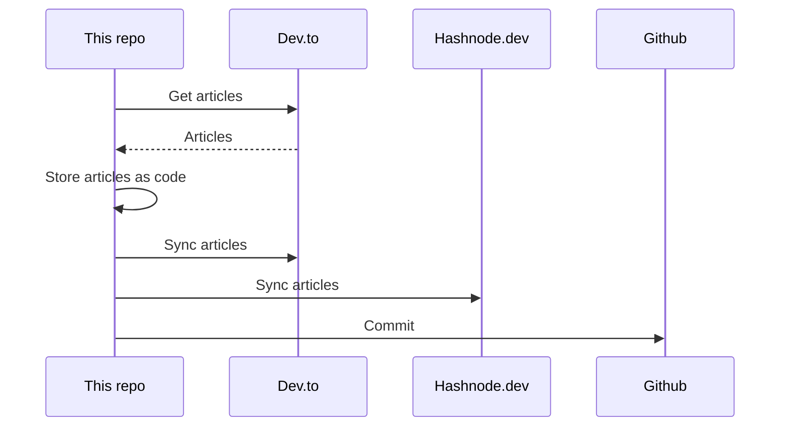

## About
This is the "single source of truth" that stores all my articles.

It utilizes [huantt/article-as-code](https://github.com/huantt/article-as-code) to collect, store, and sync all my articles to various platforms, including [dev.to](https://dev.to) and [hashnode.dev](https://hashnode.dev).

## GitHub Action
I have created a GitHub action in the `.github/workflows` directory that runs every 6 hours or whenever you commit to the `main` branch.

## My Recent Articles

<table>
        <tr>
            <td width="300px">
                <a href="https://dev.to/jacktt/search-goole-like-a-pro-cheat-sheet-4f53">
                    
                </a>
            </td>
            <td>
                <a href="https://dev.to/jacktt/search-goole-like-a-pro-cheat-sheet-4f53">Search Goole Like a Pro [Cheat sheet]</a>
                <div>Before reading my article, let&#39;s try searching the following input:    inurl:/jacktt/ site:dev.to    ...</div>
                <div><i>08/05/2024</i></div>
            </td>
        </tr>
        <tr>
            <td width="300px">
                <a href="https://dev.to/jacktt/advanced-go-build-techniques-4fk1">
                    
                </a>
            </td>
            <td>
                <a href="https://dev.to/jacktt/advanced-go-build-techniques-4fk1">Advanced Go Build Techniques</a>
                <div>Table of contents   Build options Which file will be included Build tags Build contraints           ...</div>
                <div><i>08/05/2024</i></div>
            </td>
        </tr>
        <tr>
            <td width="300px">
                <a href="https://dev.to/jacktt/search-goole-like-a-pro-cheat-sheet-536m">
                    
                </a>
            </td>
            <td>
                <a href="https://dev.to/jacktt/search-goole-like-a-pro-cheat-sheet-536m">Search Goole Like a Pro [Cheat sheet]</a>
                <div>Before reading my article, let&#39;s try searching the following input:    inurl:/jacktt/ site:dev.to    ...</div>
                <div><i>08/05/2024</i></div>
            </td>
        </tr>
        <tr>
            <td width="300px">
                <a href="https://dev.to/jacktt/advanced-go-build-techniques-29ef">
                    
                </a>
            </td>
            <td>
                <a href="https://dev.to/jacktt/advanced-go-build-techniques-29ef">Advanced Go Build Techniques</a>
                <div>Table of contents   Build options Which file will be included Build tags Build contraints           ...</div>
                <div><i>08/05/2024</i></div>
            </td>
        </tr>
        <tr>
            <td width="300px">
                <a href="https://dev.to/jacktt/solidity-concepts-1p85">
                    
                </a>
            </td>
            <td>
                <a href="https://dev.to/jacktt/solidity-concepts-1p85">Solidity concepts</a>
                <div>Concept / Keyword Description     Visibility Specifies the accessibility of functions and state...</div>
                <div><i>07/05/2024</i></div>
            </td>
        </tr>
</table>

<div align="right">

*Updated at: 2024-05-21T12:43:37Z - by **[huantt/article-listing](https://github.com/huantt/article-listing)***

</div>


## Run Locally
The `docker-compose.yml` file helps us run the flow locally.

To run this Docker Compose, create a `.secret.txt` file and fill in the following variables:
- `DEVTO_TOKEN`: Your Dev.to authentication token.
- `DEVTO_USERNAME`: Your Dev.to username.
- `HASHNODE_TOKEN`: Your Hashnode authentication token.
- `HASHNODE_USERNAME`: Your Hashnode username.

Run the following command:
```shell
docker-compose up
```

## Sequence Diagram
