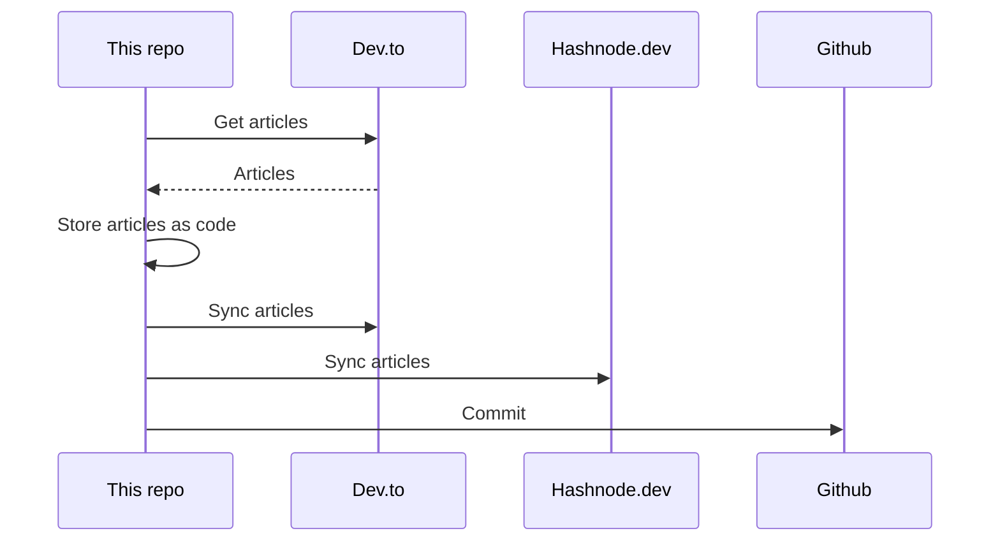

## About
This is the "single source of truth" that stores all my articles.

It utilizes [huantt/article-as-code](https://github.com/huantt/article-as-code) to collect, store, and sync all my articles to various platforms, including [dev.to](https://dev.to) and [hashnode.dev](https://hashnode.dev).

## GitHub Action
I have created a GitHub action in the `.github/workflows` directory that runs every 6 hours or whenever you commit to the `main` branch.

## My Recent Articles

<table>
        <tr>
            <td width="300px">
                <a href="https://dev.to/jacktt/writing-resume-as-code-why-not-iab">
                    
                </a>
            </td>
            <td>
                <a href="https://dev.to/jacktt/writing-resume-as-code-why-not-iab">Writing Resume as Code - Why not?</a>
                <div>Why I Developed Resume as Code   I&#39;ve explored various CV builder platforms over the...</div>
                <div><i>12/10/2023</i></div>
            </td>
        </tr>
        <tr>
            <td width="300px">
                <a href="https://dev.to/jacktt/showing-more-article-info-on-dailydev-277g">
                    
                </a>
            </td>
            <td>
                <a href="https://dev.to/jacktt/showing-more-article-info-on-dailydev-277g">Showing more Article info on Daily.dev</a>
                <div>Daily.dev is a very good extension that helps us aggregate news from several sources.  When...</div>
                <div><i>05/10/2023</i></div>
            </td>
        </tr>
        <tr>
            <td width="300px">
                <a href="https://dev.to/jacktt/article-as-code-syncing-articles-between-devto-and-multiple-blogging-platforms-3hib">
                    
                </a>
            </td>
            <td>
                <a href="https://dev.to/jacktt/article-as-code-syncing-articles-between-devto-and-multiple-blogging-platforms-3hib">[Article as Code] Syncing Articles Between Dev.to and Multiple Blogging...</a>
                <div>In the world of content creation, each platform offers unique advantages. Publishing articles on...</div>
                <div><i>03/10/2023</i></div>
            </td>
        </tr>
        <tr>
            <td width="300px">
                <a href="https://dev.to/jacktt/20x-faster-golang-docker-builds-289n">
                    
                </a>
            </td>
            <td>
                <a href="https://dev.to/jacktt/20x-faster-golang-docker-builds-289n">20X Faster Golang Docker Builds</a>
                <div>According to the Go command documentation:  &#34;The go command caches build outputs for reuse in future...</div>
                <div><i>25/09/2023</i></div>
            </td>
        </tr>
        <tr>
            <td width="300px">
                <a href="https://dev.to/jacktt/why-i-like-writing-technical-blogs-11nm">
                    
                </a>
            </td>
            <td>
                <a href="https://dev.to/jacktt/why-i-like-writing-technical-blogs-11nm">Why I Like Writing Technical Blogs</a>
                <div>Requires me to delve further into the topic   It forces me to learn more deeply about the...</div>
                <div><i>20/09/2023</i></div>
            </td>
        </tr>
</table>

<div align="right">

*Updated at: 2023-10-16T12:44:19Z - by **[huantt/article-listing](https://github.com/huantt/article-listing)***

</div>


## Run Locally
The `docker-compose.yml` file helps us run the flow locally.

To run this Docker Compose, create a `.secret.txt` file and fill in the following variables:
- `DEVTO_TOKEN`: Your Dev.to authentication token.
- `DEVTO_USERNAME`: Your Dev.to username.
- `HASHNODE_TOKEN`: Your Hashnode authentication token.
- `HASHNODE_USERNAME`: Your Hashnode username.

Run the following command:
```shell
docker-compose up
```

## Sequence Diagram
