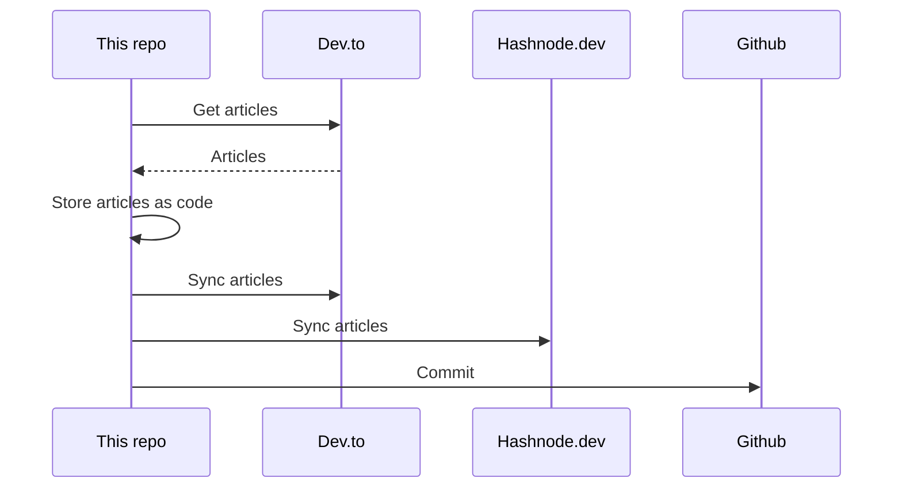

## About
This is the "single source of truth" that stores all my articles.

It utilizes [huantt/article-as-code](https://github.com/huantt/article-as-code) to collect, store, and sync all my articles to various platforms, including [dev.to](https://dev.to) and [hashnode.dev](https://hashnode.dev).

## GitHub Action
I have created a GitHub action in the `.github/workflows` directory that runs every 6 hours or whenever you commit to the `main` branch.

## My Recent Articles

<table>
        <tr>
            <td width="300px">
                <a href="https://dev.to/jacktt/scaling-read-tracking-with-redis-bitmaps-3aip">
                    
                </a>
            </td>
            <td>
                <a href="https://dev.to/jacktt/scaling-read-tracking-with-redis-bitmaps-3aip">Scaling Read Tracking with Redis Bitmaps</a>
                <div>A friend recently came to me with a problem. They had designed a feature to track whether each user...</div>
                <div><i>16/09/2025</i></div>
            </td>
        </tr>
        <tr>
            <td width="300px">
                <a href="https://dev.to/jacktt/aws-lambda-with-go-how-to-build-deploy-and-invoke-1p0o">
                    
                </a>
            </td>
            <td>
                <a href="https://dev.to/jacktt/aws-lambda-with-go-how-to-build-deploy-and-invoke-1p0o">AWS Lambda with Go - How to Build, Deploy, and...</a>
                <div>Build, Deploy, and Invoke AWS Lambda Functions in Golang            1. Initialize Lambda...</div>
                <div><i>20/08/2025</i></div>
            </td>
        </tr>
        <tr>
            <td width="300px">
                <a href="https://dev.to/jacktt/tracing-error-strack-in-golang-234o">
                    
                </a>
            </td>
            <td>
                <a href="https://dev.to/jacktt/tracing-error-strack-in-golang-234o">Tracing error strack in Golang</a>
                <div>Problem: No Stack Trace in Native Errors   Consider this Go snippet:    func function3()...</div>
                <div><i>23/05/2025</i></div>
            </td>
        </tr>
        <tr>
            <td width="300px">
                <a href="https://dev.to/jacktt/a-better-pkggodev-hip">
                    
                </a>
            </td>
            <td>
                <a href="https://dev.to/jacktt/a-better-pkggodev-hip">A better pkg.go.dev</a>
                <div>About pkgo.dev   I have never been able to read a package&#39;s documentation on pkg.go.dev...</div>
                <div><i>16/02/2025</i></div>
            </td>
        </tr>
        <tr>
            <td width="300px">
                <a href="https://dev.to/jacktt/pod-topology-spread-constraints-2pd7">
                    
                </a>
            </td>
            <td>
                <a href="https://dev.to/jacktt/pod-topology-spread-constraints-2pd7">Pod Topology Spread Constraints</a>
                <div>Pod Topology Spread Constraints   Pod Topology Spread Constraints - a.k.a...</div>
                <div><i>12/01/2025</i></div>
            </td>
        </tr>
</table>

<div align="right">

*Updated at: 2025-12-11T06:49:59Z - by **[huantt/article-listing](https://github.com/huantt/article-listing)***

</div>


## Run Locally
The `docker-compose.yml` file helps us run the flow locally.

To run this Docker Compose, create a `.secret.txt` file and fill in the following variables:
- `DEVTO_TOKEN`: Your Dev.to authentication token.
- `DEVTO_USERNAME`: Your Dev.to username.
- `HASHNODE_TOKEN`: Your Hashnode authentication token.
- `HASHNODE_USERNAME`: Your Hashnode username.

Run the following command:
```shell
docker-compose up
```

## Sequence Diagram
