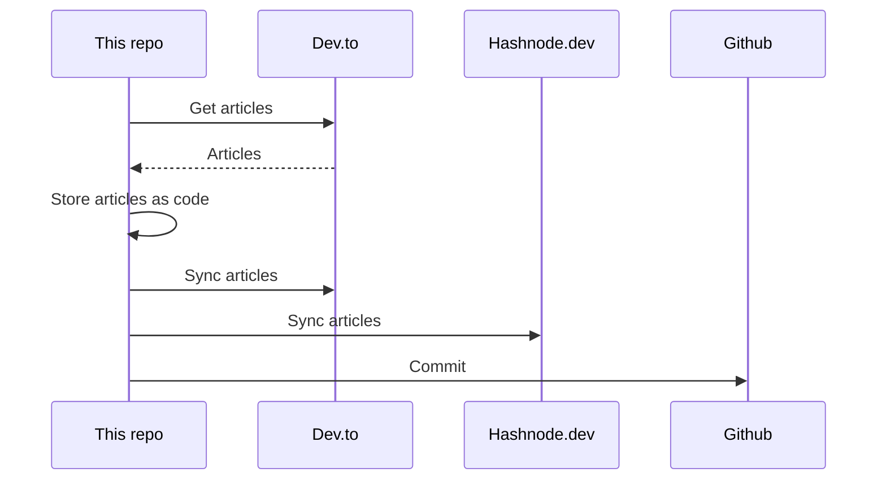

## About
This is the "single source of truth" that stores all my articles.

It utilizes [huantt/article-as-code](https://github.com/huantt/article-as-code) to collect, store, and sync all my articles to various platforms, including [dev.to](https://dev.to) and [hashnode.dev](https://hashnode.dev).

## GitHub Action
I have created a GitHub action in the `.github/workflows` directory that runs every 6 hours or whenever you commit to the `main` branch.

## My Recent Articles

<table>
        <tr>
            <td width="300px">
                <a href="https://dev.to/jacktt/solidity-concepts-1p85">
                    
                </a>
            </td>
            <td>
                <a href="https://dev.to/jacktt/solidity-concepts-1p85">Solidity concepts</a>
                <div>Concept / Keyword Description     Visibility Specifies the accessibility of functions and state...</div>
                <div><i>07/05/2024</i></div>
            </td>
        </tr>
        <tr>
            <td width="300px">
                <a href="https://dev.to/jacktt/optimistic-lock-pessimistic-lock-4h36">
                    
                </a>
            </td>
            <td>
                <a href="https://dev.to/jacktt/optimistic-lock-pessimistic-lock-4h36">Optimistic lock &amp; Pessimistic lock</a>
                <div>Pessimistic lock    Lock READ UPDATE Unlock   Example:    START TRANSACTION;  -- Select the...</div>
                <div><i>08/05/2024</i></div>
            </td>
        </tr>
        <tr>
            <td width="300px">
                <a href="https://dev.to/jacktt/kafka-dump-backup-restore-stream-40ai">
                    
                </a>
            </td>
            <td>
                <a href="https://dev.to/jacktt/kafka-dump-backup-restore-stream-40ai">Kafka dump: backup, restore, stream,...</a>
                <div>Source code   Kafka dump           Kafka data backup   Kafka dump is a tool to back up and...</div>
                <div><i>24/01/2024</i></div>
            </td>
        </tr>
        <tr>
            <td width="300px">
                <a href="https://dev.to/jacktt/kafka-dump-backup-restore-stream-22hf">
                    
                </a>
            </td>
            <td>
                <a href="https://dev.to/jacktt/kafka-dump-backup-restore-stream-22hf">Kafka dump: backup, restore, stream,...</a>
                <div>Source code   Kafka dump           Kafka data backup   Kafka dump is a tool to back up and...</div>
                <div><i>24/01/2024</i></div>
            </td>
        </tr>
        <tr>
            <td width="300px">
                <a href="https://dev.to/jacktt/saa-aws-storage-types-1noo">
                    
                </a>
            </td>
            <td>
                <a href="https://dev.to/jacktt/saa-aws-storage-types-1noo">[SAA] AWS EBS, EFS and EC2 insntace storage</a>
                <div>EBS (a.k.a. Elastic Block Store)    They are bound to a specific AZ (in specific region) You...</div>
                <div><i>24/01/2024</i></div>
            </td>
        </tr>
</table>

<div align="right">

*Updated at: 2024-05-08T12:43:56Z - by **[huantt/article-listing](https://github.com/huantt/article-listing)***

</div>


## Run Locally
The `docker-compose.yml` file helps us run the flow locally.

To run this Docker Compose, create a `.secret.txt` file and fill in the following variables:
- `DEVTO_TOKEN`: Your Dev.to authentication token.
- `DEVTO_USERNAME`: Your Dev.to username.
- `HASHNODE_TOKEN`: Your Hashnode authentication token.
- `HASHNODE_USERNAME`: Your Hashnode username.

Run the following command:
```shell
docker-compose up
```

## Sequence Diagram
