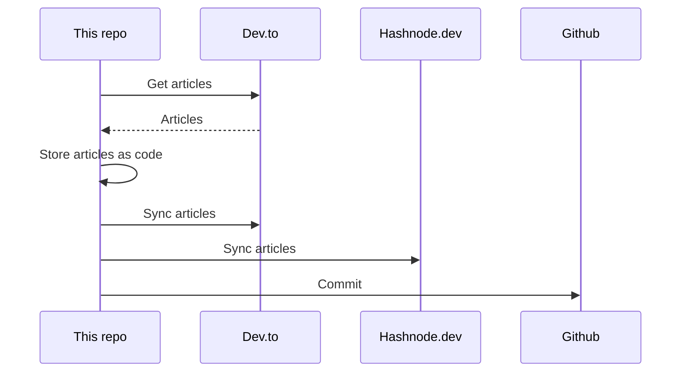

## About
This is the "single source of truth" that stores all my articles.

It utilizes [huantt/article-as-code](https://github.com/huantt/article-as-code) to collect, store, and sync all my articles to various platforms, including [dev.to](https://dev.to) and [hashnode.dev](https://hashnode.dev).

## GitHub Action
I have created a GitHub action in the `.github/workflows` directory that runs every 6 hours or whenever you commit to the `main` branch.

## My Recent Articles

<table>
        <tr>
            <td width="300px">
                <a href="https://dev.to/jacktt/exploring-some-powerful-features-of-golang-36h0">
                    
                </a>
            </td>
            <td>
                <a href="https://dev.to/jacktt/exploring-some-powerful-features-of-golang-36h0">Exploring some Powerful Features of Golang</a>
                <div>Table of content    Goroutines Channel Buffered Channel Defer Select Plugin Binary...</div>
                <div><i>31/07/2024</i></div>
            </td>
        </tr>
        <tr>
            <td width="300px">
                <a href="https://dev.to/jacktt/explaining-ab-testing-algorithm-3k6b">
                    
                </a>
            </td>
            <td>
                <a href="https://dev.to/jacktt/explaining-ab-testing-algorithm-3k6b">Explaining A/B testing algorithm</a>
                <div>We are developing a crypto news aggregator Bitesapp.co. A few days ago, we implemented A/B testing...</div>
                <div><i>30/07/2024</i></div>
            </td>
        </tr>
        <tr>
            <td width="300px">
                <a href="https://dev.to/jacktt/go-mock-30a4">
                    
                </a>
            </td>
            <td>
                <a href="https://dev.to/jacktt/go-mock-30a4">Go mock</a>
                <div>What is Go mock   Go mock is a mocking framework that allows developers to create mock...</div>
                <div><i>30/07/2024</i></div>
            </td>
        </tr>
        <tr>
            <td width="300px">
                <a href="https://dev.to/jacktt/comparing-limit-offset-and-cursor-pagination-1n81">
                    
                </a>
            </td>
            <td>
                <a href="https://dev.to/jacktt/comparing-limit-offset-and-cursor-pagination-1n81">Comparing Limit-Offset and Cursor Pagination</a>
                <div>Comparing Limit-Offset and Cursor Pagination   There are two popular methods for pagination...</div>
                <div><i>10/07/2024</i></div>
            </td>
        </tr>
        <tr>
            <td width="300px">
                <a href="https://dev.to/jacktt/showing-more-article-info-on-dailydev-239b">
                    
                </a>
            </td>
            <td>
                <a href="https://dev.to/jacktt/showing-more-article-info-on-dailydev-239b">Showing more Article info on Daily.dev</a>
                <div>Daily.dev is a very good extension that helps us aggregate news from several sources.  When...</div>
                <div><i>09/07/2024</i></div>
            </td>
        </tr>
</table>

<div align="right">

*Updated at: 2024-08-01T01:48:48Z - by **[huantt/article-listing](https://github.com/huantt/article-listing)***

</div>


## Run Locally
The `docker-compose.yml` file helps us run the flow locally.

To run this Docker Compose, create a `.secret.txt` file and fill in the following variables:
- `DEVTO_TOKEN`: Your Dev.to authentication token.
- `DEVTO_USERNAME`: Your Dev.to username.
- `HASHNODE_TOKEN`: Your Hashnode authentication token.
- `HASHNODE_USERNAME`: Your Hashnode username.

Run the following command:
```shell
docker-compose up
```

## Sequence Diagram
