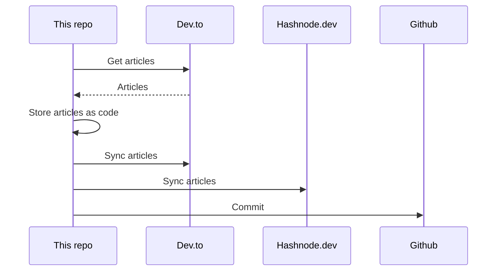

## About
This is the "single source of truth" that stores all my articles.

It utilizes [huantt/article-as-code](https://github.com/huantt/article-as-code) to collect, store, and sync all my articles to various platforms, including [dev.to](https://dev.to) and [hashnode.dev](https://hashnode.dev).

## GitHub Action
I have created a GitHub action in the `.github/workflows` directory that runs every 6 hours or whenever you commit to the `main` branch.

## My Recent Articles

<table>
        <tr>
            <td width="300px">
                <a href="https://dev.to/jacktt/kubernetes-scheduler-129i">
                    
                </a>
            </td>
            <td>
                <a href="https://dev.to/jacktt/kubernetes-scheduler-129i">Kubernetes Scheduler</a>
                <div>I. Concepts            Node labels   When create a node, we can mark some labels for it. On...</div>
                <div><i>03/01/2024</i></div>
            </td>
        </tr>
        <tr>
            <td width="300px">
                <a href="https://dev.to/jacktt/multiple-git-configs-profiles-on-one-computer-2ik">
                    
                </a>
            </td>
            <td>
                <a href="https://dev.to/jacktt/multiple-git-configs-profiles-on-one-computer-2ik">Multiple git configs (profiles) on one computer</a>
                <div>How to let git know which profile should be used in specific folders?   Imagine that you’re...</div>
                <div><i>26/10/2023</i></div>
            </td>
        </tr>
        <tr>
            <td width="300px">
                <a href="https://dev.to/jacktt/explaining-ab-testing-algorithm-50mf">
                    
                </a>
            </td>
            <td>
                <a href="https://dev.to/jacktt/explaining-ab-testing-algorithm-50mf">Explaining A/B testing algorithm</a>
                <div>We are developing a crypto news aggregator Bitesapp.co. A few days ago, we implemented A/B testing...</div>
                <div><i>25/10/2023</i></div>
            </td>
        </tr>
        <tr>
            <td width="300px">
                <a href="https://dev.to/jacktt/understanding-the-weighted-random-algorithm-581p">
                    
                </a>
            </td>
            <td>
                <a href="https://dev.to/jacktt/understanding-the-weighted-random-algorithm-581p">Understanding the Weighted Random Algorithm</a>
                <div>Imagine you have a collection of items, and each item has a different &#34;weight,&#34; or probability of...</div>
                <div><i>24/10/2023</i></div>
            </td>
        </tr>
        <tr>
            <td width="300px">
                <a href="https://dev.to/jacktt/migrate-redis-to-aws-elasticache-8bl">
                    
                </a>
            </td>
            <td>
                <a href="https://dev.to/jacktt/migrate-redis-to-aws-elasticache-8bl">Migrate Redis to AWS ElastiCache</a>
                <div>How to Migrate Redis from One Server to Another   Starting from Redis version 5.0.0, Redis...</div>
                <div><i>19/10/2023</i></div>
            </td>
        </tr>
</table>

<div align="right">

*Updated at: 2024-01-09T12:43:32Z - by **[huantt/article-listing](https://github.com/huantt/article-listing)***

</div>


## Run Locally
The `docker-compose.yml` file helps us run the flow locally.

To run this Docker Compose, create a `.secret.txt` file and fill in the following variables:
- `DEVTO_TOKEN`: Your Dev.to authentication token.
- `DEVTO_USERNAME`: Your Dev.to username.
- `HASHNODE_TOKEN`: Your Hashnode authentication token.
- `HASHNODE_USERNAME`: Your Hashnode username.

Run the following command:
```shell
docker-compose up
```

## Sequence Diagram
