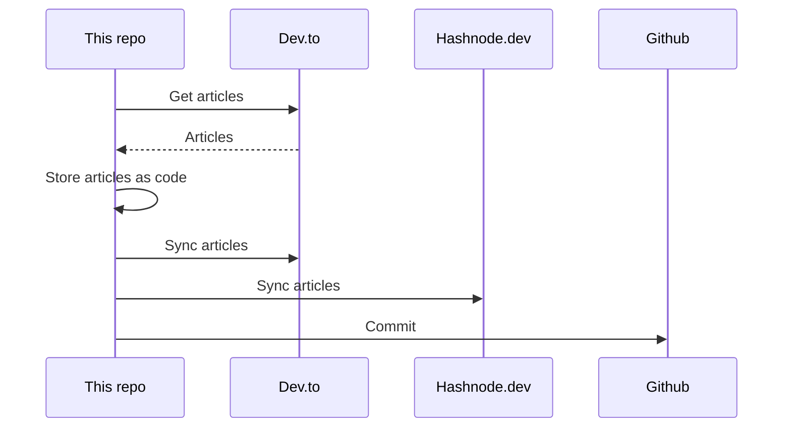

## About
This is the "single source of truth" that stores all my articles.

It utilizes [huantt/article-as-code](https://github.com/huantt/article-as-code) to collect, store, and sync all my articles to various platforms, including [dev.to](https://dev.to) and [hashnode.dev](https://hashnode.dev).

## GitHub Action
I have created a GitHub action in the `.github/workflows` directory that runs every 6 hours or whenever you commit to the `main` branch.

## My Recent Articles

<table>
        <tr>
            <td width="300px">
                <a href="https://dev.to/jacktt/graphql-types-26og">
                    
                </a>
            </td>
            <td>
                <a href="https://dev.to/jacktt/graphql-types-26og">GraphQL Types</a>
                <div>Field declaration   By default, it&#39;s valid for any field in your schema to return null...</div>
                <div><i>03/07/2024</i></div>
            </td>
        </tr>
        <tr>
            <td width="300px">
                <a href="https://dev.to/jacktt/graphql-fundamental-236k">
                    
                </a>
            </td>
            <td>
                <a href="https://dev.to/jacktt/graphql-fundamental-236k">Graphql Fundamental</a>
                <div>GraphQL provides a complete and understandable description of the API, including both &#34;API endpoints&#34;...</div>
                <div><i>03/07/2024</i></div>
            </td>
        </tr>
        <tr>
            <td width="300px">
                <a href="https://dev.to/jacktt/snowflake-schema-vs-star-schema-pros-cons-and-use-cases-2701">
                    
                </a>
            </td>
            <td>
                <a href="https://dev.to/jacktt/snowflake-schema-vs-star-schema-pros-cons-and-use-cases-2701">Snowflake Schema vs. Star Schema: Pros, Cons, and Use Cases</a>
                <div>Star Schema            Structure:     Central Fact Table: Contains quantitative data for...</div>
                <div><i>11/06/2024</i></div>
            </td>
        </tr>
        <tr>
            <td width="300px">
                <a href="https://dev.to/jacktt/is-jwt-safe-when-anyone-can-decode-plain-text-claims-2j7o">
                    
                </a>
            </td>
            <td>
                <a href="https://dev.to/jacktt/is-jwt-safe-when-anyone-can-decode-plain-text-claims-2j7o">Is JWT Safe When Anyone Can Decode Plain Text Claims</a>
                <div>If I get a JWT and can decode the payload, how is it secure? Why couldn&#39;t I just grab the token out...</div>
                <div><i>06/06/2024</i></div>
            </td>
        </tr>
        <tr>
            <td width="300px">
                <a href="https://dev.to/jacktt/understanding-the-select-for-update-sql-statement-900">
                    
                </a>
            </td>
            <td>
                <a href="https://dev.to/jacktt/understanding-the-select-for-update-sql-statement-900">Understanding the &#34;SELECT FOR UPDATE&#34; SQL Statement</a>
                <div>What is &#34;SELECT FOR UPDATE&#34;?   SELECT FOR UPDATE is a clause in SQL that is appended to a...</div>
                <div><i>06/06/2024</i></div>
            </td>
        </tr>
</table>

<div align="right">

*Updated at: 2024-07-07T18:29:28Z - by **[huantt/article-listing](https://github.com/huantt/article-listing)***

</div>


## Run Locally
The `docker-compose.yml` file helps us run the flow locally.

To run this Docker Compose, create a `.secret.txt` file and fill in the following variables:
- `DEVTO_TOKEN`: Your Dev.to authentication token.
- `DEVTO_USERNAME`: Your Dev.to username.
- `HASHNODE_TOKEN`: Your Hashnode authentication token.
- `HASHNODE_USERNAME`: Your Hashnode username.

Run the following command:
```shell
docker-compose up
```

## Sequence Diagram
