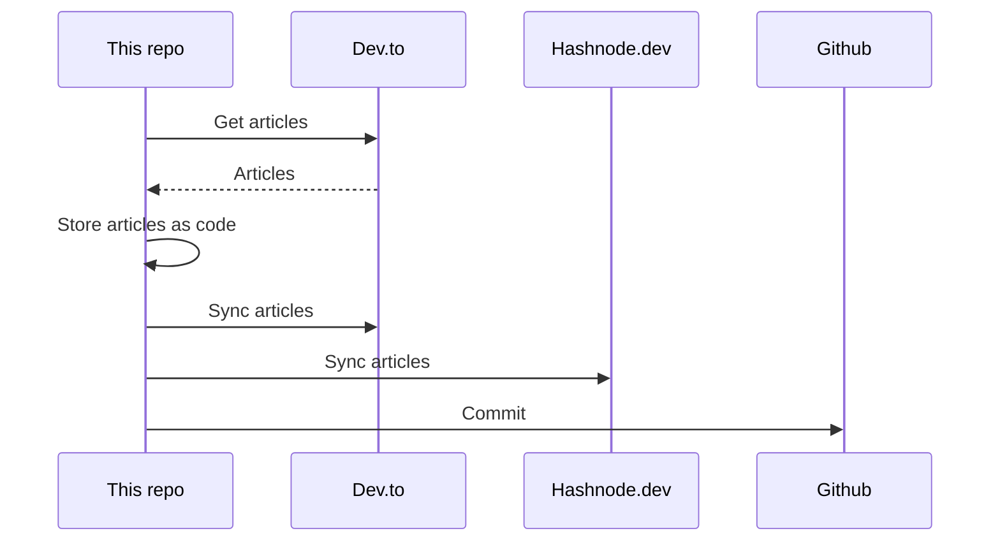

## About
This is the "single source of truth" that stores all my articles.

It utilizes [huantt/article-as-code](https://github.com/huantt/article-as-code) to collect, store, and sync all my articles to various platforms, including [dev.to](https://dev.to) and [hashnode.dev](https://hashnode.dev).

## GitHub Action
I have created a GitHub action in the `.github/workflows` directory that runs every 6 hours or whenever you commit to the `main` branch.

## My Recent Articles

<table>
        <tr>
            <td width="300px">
                <a href="https://dev.to/jacktt/understanding-the-select-for-update-sql-statement-900">
                    
                </a>
            </td>
            <td>
                <a href="https://dev.to/jacktt/understanding-the-select-for-update-sql-statement-900">Understanding the &#34;SELECT FOR UPDATE&#34; SQL Statement</a>
                <div>What is &#34;SELECT FOR UPDATE&#34;?   SELECT FOR UPDATE is a clause in SQL that is appended to a...</div>
                <div><i>06/06/2024</i></div>
            </td>
        </tr>
        <tr>
            <td width="300px">
                <a href="https://dev.to/jacktt/managing-concurrent-purchases-of-limited-items-in-a-database-2gm0">
                    
                </a>
            </td>
            <td>
                <a href="https://dev.to/jacktt/managing-concurrent-purchases-of-limited-items-in-a-database-2gm0">Managing Concurrent Purchases of Limited Items in a Database</a>
                <div>Imagine that we&#39;re developing an e-commerce website. In this case, we have a limited number of items...</div>
                <div><i>06/06/2024</i></div>
            </td>
        </tr>
        <tr>
            <td width="300px">
                <a href="https://dev.to/jacktt/why-does-not-postgres-use-my-index-5apf">
                    
                </a>
            </td>
            <td>
                <a href="https://dev.to/jacktt/why-does-not-postgres-use-my-index-5apf">Why does not postgres use my index?</a>
                <div>This is a quick note           1. Query Conditions Not Matching the Index    The index is not on the...</div>
                <div><i>05/06/2024</i></div>
            </td>
        </tr>
        <tr>
            <td width="300px">
                <a href="https://dev.to/jacktt/advanced-go-build-techniques-4fk1">
                    
                </a>
            </td>
            <td>
                <a href="https://dev.to/jacktt/advanced-go-build-techniques-4fk1">Advanced Go Build Techniques</a>
                <div>Table of contents   Build options Which file will be included Build tags Build contraints           ...</div>
                <div><i>08/05/2024</i></div>
            </td>
        </tr>
        <tr>
            <td width="300px">
                <a href="https://dev.to/jacktt/solidity-concepts-1p85">
                    
                </a>
            </td>
            <td>
                <a href="https://dev.to/jacktt/solidity-concepts-1p85">Solidity concepts</a>
                <div>Concept / Keyword Description     Visibility Specifies the accessibility of functions and state...</div>
                <div><i>07/05/2024</i></div>
            </td>
        </tr>
</table>

<div align="right">

*Updated at: 2024-06-07T01:38:20Z - by **[huantt/article-listing](https://github.com/huantt/article-listing)***

</div>


## Run Locally
The `docker-compose.yml` file helps us run the flow locally.

To run this Docker Compose, create a `.secret.txt` file and fill in the following variables:
- `DEVTO_TOKEN`: Your Dev.to authentication token.
- `DEVTO_USERNAME`: Your Dev.to username.
- `HASHNODE_TOKEN`: Your Hashnode authentication token.
- `HASHNODE_USERNAME`: Your Hashnode username.

Run the following command:
```shell
docker-compose up
```

## Sequence Diagram
