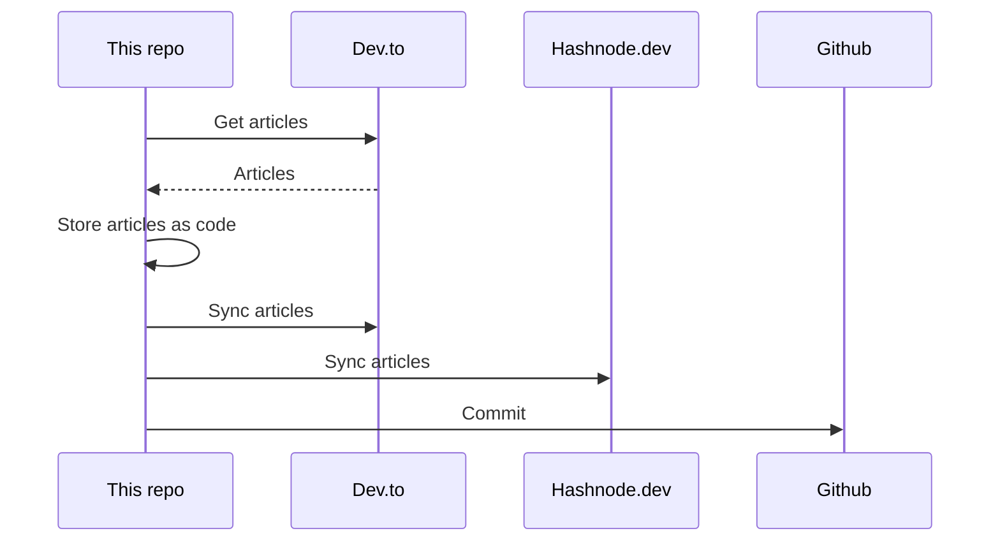

## About
This is the "single source of truth" that stores all my articles.

It utilizes [huantt/article-as-code](https://github.com/huantt/article-as-code) to collect, store, and sync all my articles to various platforms, including [dev.to](https://dev.to) and [hashnode.dev](https://hashnode.dev).

## GitHub Action
I have created a GitHub action in the `.github/workflows` directory that runs every 6 hours or whenever you commit to the `main` branch.

## My Recent Articles

<table>
        <tr>
            <td width="300px">
                <a href="https://dev.to/jacktt/kubernetes-probes-livenssprobe-readinessprobe-and-startupprobe-3j37">
                    
                </a>
            </td>
            <td>
                <a href="https://dev.to/jacktt/kubernetes-probes-livenssprobe-readinessprobe-and-startupprobe-3j37">Kubernetes probes: startupProbe, livenssProbe, and readinessProbe</a>
                <div>Liveness   Liveness probes determine when to restart a container.   If the liveness probe...</div>
                <div><i>07/08/2024</i></div>
            </td>
        </tr>
        <tr>
            <td width="300px">
                <a href="https://dev.to/jacktt/kubernetes-scheduler-3b68">
                    
                </a>
            </td>
            <td>
                <a href="https://dev.to/jacktt/kubernetes-scheduler-3b68">Kubernetes Scheduler</a>
                <div>I. Concepts            Node labels   When create a node, we can mark some labels for it. On...</div>
                <div><i>31/07/2024</i></div>
            </td>
        </tr>
        <tr>
            <td width="300px">
                <a href="https://dev.to/jacktt/kubernetes-scheduler-1173">
                    
                </a>
            </td>
            <td>
                <a href="https://dev.to/jacktt/kubernetes-scheduler-1173">Kubernetes Scheduler</a>
                <div>I. Concepts            Node labels   When create a node, we can mark some labels for it. On...</div>
                <div><i>31/07/2024</i></div>
            </td>
        </tr>
        <tr>
            <td width="300px">
                <a href="https://dev.to/jacktt/kubernetes-scheduler-3opf">
                    
                </a>
            </td>
            <td>
                <a href="https://dev.to/jacktt/kubernetes-scheduler-3opf">Kubernetes Scheduler</a>
                <div>I. Concepts            Node labels   When create a node, we can mark some labels for it. On...</div>
                <div><i>31/07/2024</i></div>
            </td>
        </tr>
        <tr>
            <td width="300px">
                <a href="https://dev.to/jacktt/exploring-some-powerful-features-of-golang-36h0">
                    
                </a>
            </td>
            <td>
                <a href="https://dev.to/jacktt/exploring-some-powerful-features-of-golang-36h0">Exploring some Powerful Features of Golang</a>
                <div>Table of content    Goroutines Channel Buffered Channel Defer Select Plugin Binary...</div>
                <div><i>31/07/2024</i></div>
            </td>
        </tr>
</table>

<div align="right">

*Updated at: 2024-08-22T06:33:15Z - by **[huantt/article-listing](https://github.com/huantt/article-listing)***

</div>


## Run Locally
The `docker-compose.yml` file helps us run the flow locally.

To run this Docker Compose, create a `.secret.txt` file and fill in the following variables:
- `DEVTO_TOKEN`: Your Dev.to authentication token.
- `DEVTO_USERNAME`: Your Dev.to username.
- `HASHNODE_TOKEN`: Your Hashnode authentication token.
- `HASHNODE_USERNAME`: Your Hashnode username.

Run the following command:
```shell
docker-compose up
```

## Sequence Diagram
