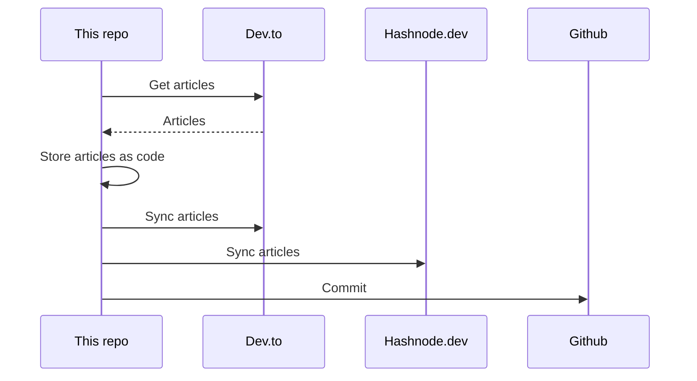

## About
This is the "single source of truth" that stores all my articles.

It utilizes [huantt/article-as-code](https://github.com/huantt/article-as-code) to collect, store, and sync all my articles to various platforms, including [dev.to](https://dev.to) and [hashnode.dev](https://hashnode.dev).

## GitHub Action
I have created a GitHub action in the `.github/workflows` directory that runs every 6 hours or whenever you commit to the `main` branch.

## My Recent Articles

<table>
        <tr>
            <td width="300px">
                <a href="https://dev.to/jacktt/bmad-cheat-sheet-5ab2">
                    
                </a>
            </td>
            <td>
                <a href="https://dev.to/jacktt/bmad-cheat-sheet-5ab2">BMAD cheat sheet</a>
                <div>Module 1: BMM (Business Model Management)   The main product development module, designed...</div>
                <div><i>11/03/2026</i></div>
            </td>
        </tr>
        <tr>
            <td width="300px">
                <a href="https://dev.to/jacktt/bmad-quick-flow-15en">
                    
                </a>
            </td>
            <td>
                <a href="https://dev.to/jacktt/bmad-quick-flow-15en">BMAD Quick Flow</a>
                <div>BMAD Quick Flow   Quick Flow is the lean path inside the BMAD Method. It skips the full...</div>
                <div><i>11/03/2026</i></div>
            </td>
        </tr>
        <tr>
            <td width="300px">
                <a href="https://dev.to/jacktt/bmad-standard-workflow-2kma">
                    
                </a>
            </td>
            <td>
                <a href="https://dev.to/jacktt/bmad-standard-workflow-2kma">BMAD Standard Workflow</a>
                <div>BMAD Standard Workflow Guide            Overview   BMAD (Business Methods and Development)...</div>
                <div><i>11/03/2026</i></div>
            </td>
        </tr>
        <tr>
            <td width="300px">
                <a href="https://dev.to/jacktt/understanding-the-agents-in-the-bmad-235o">
                    
                </a>
            </td>
            <td>
                <a href="https://dev.to/jacktt/understanding-the-agents-in-the-bmad-235o">Understanding the Agents in the BMAD</a>
                <div>BMAD Agents   BMAD uses a team of specialized agents, each representing a distinct role in...</div>
                <div><i>11/03/2026</i></div>
            </td>
        </tr>
        <tr>
            <td width="300px">
                <a href="https://dev.to/jacktt/co-be-ban-diem-phien-ban-2026-618">
                    
                </a>
            </td>
            <td>
                <a href="https://dev.to/jacktt/co-be-ban-diem-phien-ban-2026-618">Cô bé bán diêm phiên bản 2026</a>
                <div>Đêm đông 2026, văn phòng vắng tanh. Một cậu dev ngồi OT, tay gõ từng dòng code cho kịp deadline: 5...</div>
                <div><i>14/01/2026</i></div>
            </td>
        </tr>
</table>

<div align="right">

*Updated at: 2026-03-19T03:20:05Z - by **[huantt/article-listing](https://github.com/huantt/article-listing)***

</div>


## Run Locally
The `docker-compose.yml` file helps us run the flow locally.

To run this Docker Compose, create a `.secret.txt` file and fill in the following variables:
- `DEVTO_TOKEN`: Your Dev.to authentication token.
- `DEVTO_USERNAME`: Your Dev.to username.
- `HASHNODE_TOKEN`: Your Hashnode authentication token.
- `HASHNODE_USERNAME`: Your Hashnode username.

Run the following command:
```shell
docker-compose up
```

## Sequence Diagram

```mermaid
sequenceDiagram
This repo ->> Dev.to: Get articles
Dev.to -->> This repo: Articles
This repo ->> This repo: Store articles as code
This repo ->> Dev.to: Sync articles
This repo ->> Hashnode.dev: Sync articles
This repo ->> Github: Commit
```